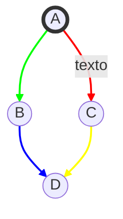
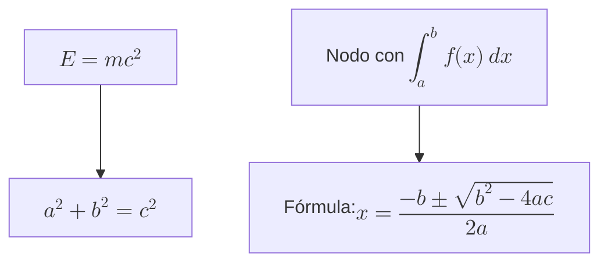
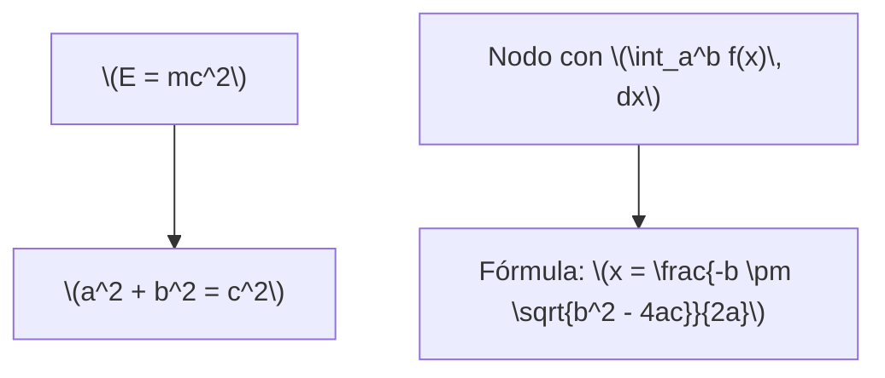

En este ejemplo:

- `linkStyle 0 stroke:#f00,stroke-width:2px;` hace que la primera flecha sea roja (`#f00`).
- `linkStyle 1 stroke:#0f0,stroke-width:2px;` hace que la segunda flecha sea verde (`#0f0`).
- `linkStyle 2 stroke:#00f,stroke-width:2px;` hace que la tercera flecha sea azul (`#00f`).
- `linkStyle 3 stroke:#ff0,stroke-width:2px;` hace que la cuarta flecha sea amarilla (`#ff0`).

Puedes ajustar los colores y el ancho de las líneas según tus necesidades. 

En este ejemplo:

- Los nodos `A`, `B`, `C`, y `D` contienen fórmulas en LaTeX.
- Las fórmulas están encerradas entre `\( \)` para el modo en línea, pero también podrías usar `$$ $$` para ecuaciones en bloque si el entorno lo soporta.

### Consideraciones:

1. **Compatibilidad:** Asegúrate de que la plataforma donde estás usando Mermaid soporta la renderización de LaTeX. Algunas plataformas, como GitHub y algunos editores Markdown, pueden no renderizar LaTeX dentro de Mermaid directamente.
   
2. **Alternativa:** Si necesitas asegurarte de que las fórmulas se rendericen correctamente en todas las plataformas, considera usar imágenes generadas de las fórmulas y referenciarlas en los nodos en lugar de texto LaTeX.

