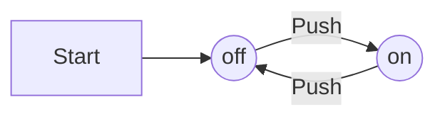

Authomata theory is the study of abstract computing devices, or "machines".

Before there were computers, in 1930's, Alan Turing studied an abstract machine that had all the capabilities of today's computers, at least as far as in what they could compute. Turing's goal was to describe precisely the boundary between what a computing machine could do and what it could not do; his conclusions apply not only to his abstract _Turing machines_, but to today's real machines.

**Example 1:** Perhaps the simplest non-trivial finite automaton is an on/off switch.
The device remembers wheter it is in the "on" state or the "off" state, and it allows the user to press a button whose effect is different, depending on the state of the switch.

The finite-automaton model for the switch:

As for all finite automata, the states are represented by circles; Arc between states are labeled by "inputs", which represent external influences on the system.

One of the states is designated the "start state" the state in which the system is placed initially.
